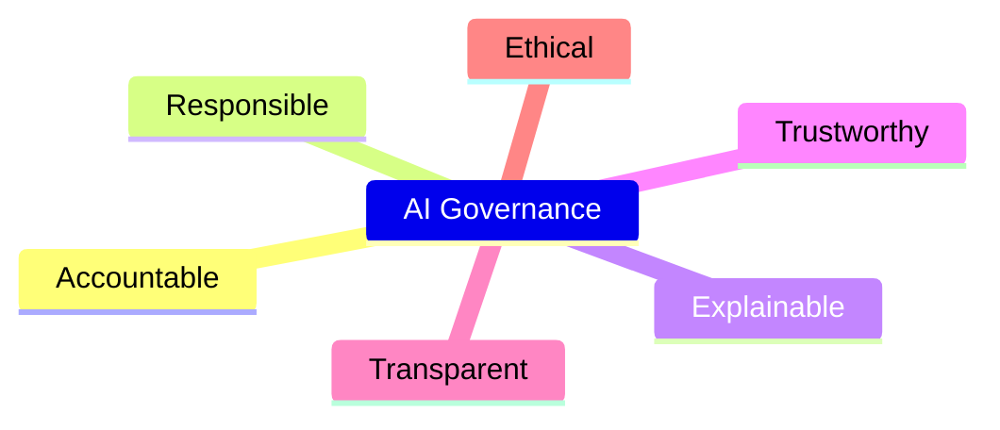

# VS Live! Notes

[All Conference Session Slides](https://vslive.com/events/san-diego-2025/tracks/track-list.aspx)

Click the PDF link to the right and enter the login information.

* **See Tara for login information**

## Takeaways

* Choose the right model! Not all models are trained the same.
* Leverage MCP where possible.
* Consider Aspire to manage tech stack during development.

## Monday

Monday was a hands-on lab with Brian Randell.

### Dev Ops Agent (CoPilot)

#### Local

[Lab Assignment Repo](https://github.com/brianrandell/vsl25sdhol)

[Repository](https://github.com/lostpanda85/vs-live-lab)

##### Local App

* ASP.Net Blazor Front End (locally/kestrel)
* Aspire-enabled
  * Framework for C#
  * Better Refresh (F5) Experience
  * Vector DB
  * AI-Chat Web App
    * Ollama
    * Text-only, not multi-modal
  * PDF links for "Source of Truth", most likely will train on it??
* Generates output with links to "Source of Truth" using a [RAG (Retrieval Augmented Generation)](https://learn.microsoft.com/en-us/azure/search/retrieval-augmented-generation-overview?tabs=docs) pattern and Vector DB
* MCP
  * Reaches out to GitHub to take action
  * Uses natural language processing
  * Can also generate GitHub issues for feature requests

##### Lab Notes

4o mini seems faster than Nemo
Nemo does better with explanation, code clarity and advice

I would use 4o in places where I need a fast result. I would use Nemo when I want a clearer result or if I'm doing a code review.

Prompt seemed to impact overall tone and in-depth analysis. Temperature seemed to impact accuracy.

Nemo Compared to DeepSeek R1 -> nemo was faster and more concise
DeepSeek displayed its thought process and was much more verbose.

##### General

* Fun Fact - DeepSeek needs 671 GB of RAM to run fully locally.
* Ollama - Open source runtime environment for AI.
* Small chunks = better.
* Model stays in memory until cleared, makes subsequent requests faster.
* MCP (Model Context Protocol) a way for clients and services to communicate, either agent to agent or person to agent.
  * Gets us away from tightly coupled solutions.
  * Server side manages things.
  * Client role consumes the model context.
  * Simplifies context management.
  * Improves model responsiveness.
  * Opens the door to multi-model orchestration.
* Cloud version of the app does pretty much the same, except computation is done in the cloud. It was much faster by comparison.
* Azure Search used to be Cognitive services, has competitive edge since its very mature.
* [GitHub models let you try different models to find the right fit and gets it setup in AzureAI.](https://github.com/marketplace?type=models)
* NLP (Natural Language Processing) is for computers to understand human language.
* LM (Language Models) use probability distributions to generate sequences of words.
* LLM (Large Language Models) are just really really really big language models.
* All use tokens to process requests. Tokens are not words, but they are pieces of the request/response.
* Real time search outside of the sandboxed training data is now possible. Asking about newer things like stocks and game outcomes should work. Newer language syntax may not be.
* LoRAs can be used to fine-tune models to reduce bias, add diversity, and adjust the 'style' as desired for images or other modes.
* [HuggingFace](https://huggingface.co) is a Model community that lists all models.
* Ollama is equivalent to Azure AI Services, but its self-host. Turbo sends it out to the cloud.

[Stephen Wolfram's What is ChatGPT doing???](https://bri.gd/swchatgpt)

## Tuesday

Tuesday is a session and keynote day.

### Agentic & Agent: You Keep Saying Those Words

* Brian Randell

AI Agent -> system that perceives, decides, and acts autonomously. Designed for autonomous decisions making and pursuing defined goals independently.

Agentic behavior -> goal-directed actions with planning & tool use.

Key -> initiative and adaptability beyond single prompt-response.

Not all AI is agentic -> requires true decision making capabilities.

Agents work, at their basic level by the User Provides data, agent has autonomy to accomplish their goal.

System vs Behavior Distinction -> differentiating AI systems from their agentic behavior clarifies goals and implementation strategies.

GitHub MCP only works with GitHub. It can't sent an email, but it can check github issues.

LLMs retain 'memory', and can recall things from previous chats.

Models are standardized with similar syntax, think terminals (zsh, bash, powershell).

Autonomous Chat Assistants -> interact naturally, understand content, and provide helpful responses autonomously.

Multi-Step Planning Bots -> capable of organizing tasks in sequence to achieve complex objectives independently.

Adaptive Recommendation Systems -> systems that learn user preferences and adapt recommendations over time dramatically.

In automation, traditional is predictable but not adaptive. Agentic is adaptive, but less predictable.

Agentic systems are contextually aware, and are great at handling complex multi-step problems.

Most issues with AI are going to be data issues.

MCP (Model Context Protocol) JSON standard to allow models to talk to one another and to connect to external services.

MCP is lead by Anthropic and Microsoft is on-board.

MCP also provides scalable infrastructure.

Best Practices for Defining Agents. Keep It Simple. Clear objectives. Small focused agents. Add guardrails and human oversight.

### Generative AI in Enterprise

* Lino Tadros

AI and Security are concerns. Volume of vectorized data might be too much for RAG patterns.

Load balancing is also a concern, along with TPM limits across multiple applications. Most likely needs a custom implemented rate-limiter.

TPM errors (HTTP 429) need validated in testing, scale is an issue that might not be discovered in testing since the volume is low.

Leverage LLMs is all about prompt engineering (MISCONCEPTION!!!)\
Who provides the UI?\
Who monitors scale?\
Who chooses and validates the models?\
Model choice can lead to quite a bit of lost or gained value.\
Consider Ollama, its self-hosted!\
How do we safeguard secrets, PII, CHSD?\
When do we recreate indexes in the vectorized data?

Who uses AI? Everyone! Recruiting sectors are particularly bad because their models are garbage.

Large enterprises (Apple, JPMorgan, Goldman Sachs, Samsun) were initially very weary of AI due to hallucinations, bad information, and inaccurate results. Deepfakes are also a huge concern. These enterprises are using RAI (Responsible AI) instead of providing direct access to Models. Companies were also weary of their data being stolen and the models trained on it. This is largely not a concern since its very expensive to retrain models.

Who are the decision makes? CISO, CTO, Lead of Innovation (Architect), Head of Data Science, Business Heads, Chief Data Officer, CIO, Lawyers

Prompt flow is being phased out, don't use it.

Pick and choose the right model! This matters as models are trained on different data.

#### KEEP AI TIED TO BUSINESS STRATEGIES

* Educate yourself
* Develop metrics
* Prepare for AI
  * Consider cyber security posture
  * Consider network infrastructure
  * Consider data security
  * Consider network security
* Build AI
* Algin AI goals to business goals
* Identify use-cases!
* Create a structure for the successful build and use of AI

### Catching up with C# Interfaces

* Jeremy Clark

### VS Code for Everyone

* Brian Randell

## Wednesday

## Thursday
