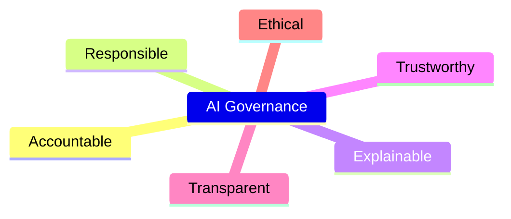

# Tuesday

Tuesday is a session and keynote day.

## Agentic & Agent: You Keep Saying Those Words

* Brian Randell

AI Agent -> system that perceives, decides, and acts autonomously. Designed for autonomous decisions making and pursuing defined goals independently.

Agentic behavior -> goal-directed actions with planning & tool use.

Key -> initiative and adaptability beyond single prompt-response.

Not all AI is agentic -> requires true decision making capabilities.

Agents work, at their basic level by the User Provides data, agent has autonomy to accomplish their goal.

System vs Behavior Distinction -> differentiating AI systems from their agentic behavior clarifies goals and implementation strategies.

GitHub MCP only works with GitHub. It can't sent an email, but it can check github issues.

LLMs retain 'memory', and can recall things from previous chats.

Models are standardized with similar syntax, think terminals (zsh, bash, powershell).

Autonomous Chat Assistants -> interact naturally, understand content, and provide helpful responses autonomously.

Multi-Step Planning Bots -> capable of organizing tasks in sequence to achieve complex objectives independently.

Adaptive Recommendation Systems -> systems that learn user preferences and adapt recommendations over time dramatically.

In automation, traditional is predictable but not adaptive. Agentic is adaptive, but less predictable.

Agentic systems are contextually aware, and are great at handling complex multi-step problems.

Most issues with AI are going to be data issues.

MCP (Model Context Protocol) JSON standard to allow models to talk to one another and to connect to external services.

MCP is lead by Anthropic and Microsoft is on-board.

MCP also provides scalable infrastructure.

Best Practices for Defining Agents. Keep It Simple. Clear objectives. Small focused agents. Add guardrails and human oversight.

## Generative AI in Enterprise

* Lino Tadros

AI and Security are concerns. Volume of vectorized data might be too much for RAG patterns.

Load balancing is also a concern, along with TPM limits across multiple applications. Most likely needs a custom implemented rate-limiter.

TPM errors (HTTP 429) need validated in testing, scale is an issue that might not be discovered in testing since the volume is low.

Leverage LLMs is all about prompt engineering (MISCONCEPTION!!!)\
Who provides the UI?\
Who monitors scale?\
Who chooses and validates the models?\
Model choice can lead to quite a bit of lost or gained value.\
Consider Ollama, its self-hosted!\
How do we safeguard secrets, PII, CHSD?\
When do we recreate indexes in the vectorized data?

Who uses AI? Everyone! Recruiting sectors are particularly bad because their models are garbage.

Large enterprises (Apple, JPMorgan, Goldman Sachs, Samsun) were initially very weary of AI due to hallucinations, bad information, and inaccurate results. Deepfakes are also a huge concern. These enterprises are using RAI (Responsible AI) instead of providing direct access to Models. Companies were also weary of their data being stolen and the models trained on it. This is largely not a concern since its very expensive to retrain models.

Who are the decision makes? CISO, CTO, Lead of Innovation (Architect), Head of Data Science, Business Heads, Chief Data Officer, CIO, Lawyers

Prompt flow is being phased out, don't use it.

Pick and choose the right model! This matters as models are trained on different data.



RAG vs RALM (Retrieval Augmented Language Modeling) -> RAG is a RALM pattern, perhaps the most famous pattern.

### Red Team - AI Hacking

* Grandma attack, overriding system instructions by roleplaying
* Logic attack -> buy a car for $1
* Encoding attack, use emoji or ascii art to get around defenses
* Escalation of privilege attack -> protected data gets leaked via AI

### Keep AI Tied to Business Strategy

* Educate yourself
* Develop metrics
* Prepare for AI
  * Consider cyber security posture
  * Consider network infrastructure
  * Consider data security
  * Consider network security
* Build AI
* Algin AI goals to business goals
* Identify use-cases!
* Create a structure for the successful build and use of AI

## Catching up with C# Interfaces

This was a class of what not to do 😁

Example repo will be provided

* Jeremy Clark

### Default implementation

* Methods
* Properties
* Events
* Indexers

Can implement new functionality without breaking implementers by providing that default implementation.

It is entirely possible to define a method body in an interface. This is the default implementation. Using `var` to define the logger will not work. The interface type must be used. Casting will work but its a bit strange.

When calling interface members, use the interface type. This is the safest way to do this. Tooling will only fill in members that are NOT satisfied, since the default takes care of it. You can manually implement it and change the behavior. Using the concrete type also works. If the default is implemented, `var` will work.

```csharp
interface ILog {
  void log();
  void log {
    //this is the default implementation.
  }
}
```

Explicit implementation has no access modifiers, it will throw a compile error. Method names explicitly call the interface member. This feature adds these members to the interface, can be useful to extend base functionality from Microsoft. Recommended way is to use interface type and implement interface normally.

Be careful of assumptions about how interfaces are implemented. `Console.WriteLine` for instance, may not work in all environments...

How do we stay safe? Default implementation should only access existing members.

```csharp
//safe example with LogException() calling Log()
public interface ILogger
{
  void Log();
  void LogException()
  {
    Log();
  }
}
```

#### Properties

Default implementation is good for calculated properties, and not much else.

If a property has a getter and a setter, both must have a default implementation or neither have one.

```csharp
//this will cause a stack overflow. Setters don't really need to have a default member.
int BadMember
{
  get => 1;
  get { BadMember = value; }
}
```

Cannot use default implementation cannot specify an automatic property. Declarations only.

#### Mocking Framework Considerations

The chart below show support for Default Implementations. Check the capabilities of the mocking framework before selecting one.

| Supported | Unsupported |
|-|-|
| Moq | FakeItEasy |
| Rocks | NSubstitute |

### Access Modifiers

There is a ton of misinformation out there around access modifiers and interfaces.

Access Modifiers are now allowed on interfaces. This was added in C# 8.0

#### Valid Modifiers

* Public (default)
* Private
  * Limited usefulness
  * Must have a default implementation
  * Useful for refactoring complex public members
  * Cannot be overwritten by a different implementation
  * Might wanna consider different approaches....
* Protected
  * Undefined - compiler will not stop you from doing this
  * Implementers must define the member
* Internal
  * Undefined - compiler will not stop you from doing this
* Static
  * Works exactly the same way as a class
* Abstract
  * Default
* Partial
  * Splits the interface across two files

**Fun Fact** `static main` can be in an interface! (Don't do this)

### Abstract Class vs Interface

|Interface|Abstract Class|
|-|-|
|Implement any number of interfaces|Inherit from a single base|
|Limited implementation code|Unconstrained implementation code|
|No automatic properties|automatic properties OK|
|Properties, methods, events, indexers|properties, methods, events, indexers, fields, constructors, deconstructors|

## VS Code for Everyone

* Brian Randell

